# lillian0x

infra tinkerer running NixOS + Hyprland

 

- 🔧 Currently deep in **NixOS** / **nix flakes**, keeping everything declarative
- ☁️ Wiring up **Kubernetes** clusters with **FluxCD** for GitOps
- 🖥️ Daily driver: **Linux**, **Hyprland**, **Neovim**
- 🌱 Writing **Nix**, **TypeScript** and **Lua**, occasionally dropping into **C**

 

LANGUAGE
 

  

OS
 

  

INFRA
 

  

TOOL
 

 

 

thanks for stopping by

